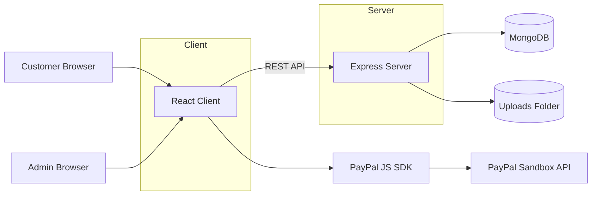
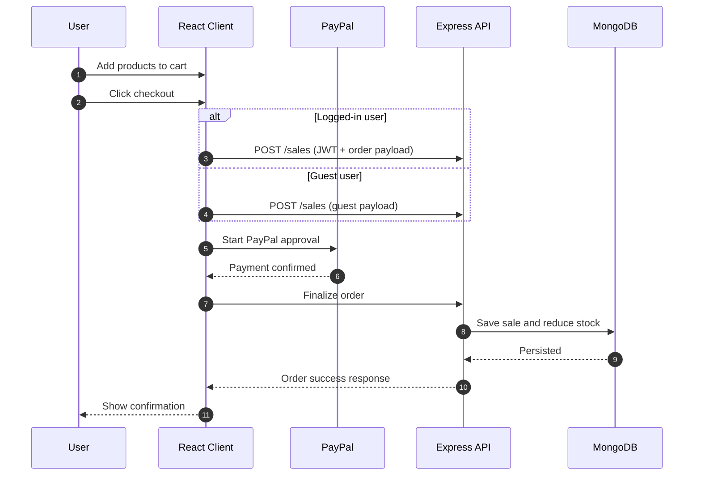
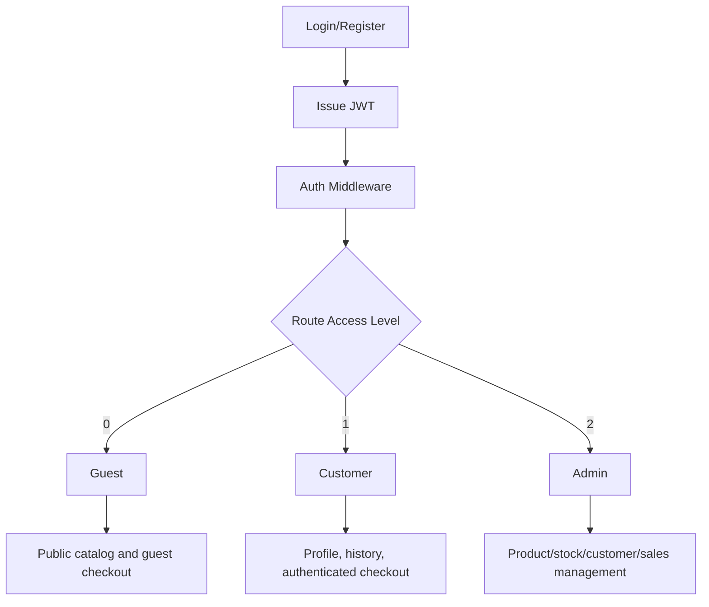

# Emerald Sip

Full-stack e-commerce web application for reusable bottles and eco-friendly products.

## What This Project Is

Emerald Sip is a learning-oriented production-style web shop with a complete customer and admin workflow:

- Customer catalog browsing, cart management, and checkout
- Guest and authenticated purchase flows
- JWT-based authentication and profile management
- Admin product, stock, customer, and sales management

## Core Stack

- Frontend: React (CRA), React Router v5, Axios
- Backend: Node.js, Express
- Database: MongoDB, Mongoose
- Payments: PayPal (sandbox)

## System Architecture



## Checkout Flow



## Access and Authorization Model



## Features

### Customer-facing

- Product catalog with search, filtering, and sorting
- Product details modal with image gallery
- Cart with quantity controls and stock-aware behavior
- Cart icon toggle behavior (click again removes an item)
- PayPal checkout for guest and logged-in users
- Registration and login with JWT authorization
- Profile editing with optional profile photo upload
- Purchase history with search, filtering, and sorting
- Per-item return action in purchase history

### Admin-facing

- Add, edit, and delete products
- Adjust product stock levels
- View customers
- View customer purchase history
- Route-level and role-based access protection

## Tech Details

### Client dependencies

- `react` 16.9
- `react-router-dom` 5.0
- `axios`
- `@paypal/react-paypal-js`

### Server dependencies

- `express` 5
- `mongoose` 8
- `jsonwebtoken`
- `bcryptjs`
- `multer`
- `cors`
- `dotenv`

## Project Structure

```text
.
├── docs
│   └── screenshots
├── client
│   ├── public
│   └── src
│       ├── components
│       ├── hooks
│       ├── config
│       └── css
├── server
│   ├── config
│   ├── models
│   ├── routes
│   ├── seeds/default
│   └── uploads
├── ProjectProgress.md
└── README.md
```

## Screenshots

<details>
  <summary>Click to open screenshots</summary>

**1. Product Catalog (Guest View)**


**2. Shopping Cart**


**3. Guest Checkout Validation**


**4. Login Page**


**5. Product Catalog (Admin Management View)**


**6. Admin Adjust Stock**


**7. Admin View Customers**


**8. Admin Customer Purchase History**


**9. Admin Profile Modal**


**10. Edit Profile Page**


**11. Registration Page**


**12. Product Catalog (Logged-In Customer View)**


**13. Product Catalog with Active Filters**


**14. Customer Purchase History**


</details>

## Demo Video

<video src="./docs/screencast.mp4" autoplay muted loop playsinline controls preload="metadata" width="100%">
  Your browser does not support embedded video.
</video>

Direct link: [Watch screencast](./docs/screencast.mp4)

## Prerequisites

- Node.js 18+
- npm
- Local MongoDB on default host/port (`mongodb://localhost`)

## Environment Configuration (Server)

The backend loads environment variables from:

- `server/config/.env`

Required keys:

```env
DB_NAME=SustainableHomeStore
ACCESS_LEVEL_GUEST=0
ACCESS_LEVEL_CUSTOMER=1
ACCESS_LEVEL_ADMIN=2
JWT_PRIVATE_KEY_FILENAME=./config/jwt_private_key.pem
JWT_EXPIRY=7d
PASSWORD_HASH_SALT_ROUNDS=3
UPLOADED_FILES_FOLDER=./uploads
SERVER_PORT=4000
LOCAL_HOST=http://localhost:3000
```

## Local Setup

1. Install dependencies:

```bash
cd server && npm install
cd ../client && npm install
```

2. Start MongoDB locally.

3. Start backend (port `4000`):

```bash
cd server
nodemon
```

4. Start frontend (port `3000`):

```bash
cd client
npm start
```

5. Open `http://localhost:3000`

## Development Notes

- Client API base URL is defined in `client/src/config/global_constants.js` (`SERVER_HOST`)
- PayPal sandbox client ID is currently stored in `client/src/config/global_constants.js`
- Profile images uploaded from the app are stored in `server/uploads`

## Seed Data

Default datasets for local initialization:

- `server/seeds/default/products.json`
- `server/seeds/default/users.json`
- `server/seeds/default/sales.json`

## API Overview

Main route groups:

- `/products`: public reads + admin create/update/delete
- `/users`: register/login, profile actions, admin customer management
- `/sales`: checkout, purchase history, returns, admin purchase history

