# Emerald Sip E-Commerce Web Application

Full-stack e-commerce web application for reusable bottles and eco-friendly products.

- Frontend: React (CRA, React Router v5)
- Backend: Node.js + Express
- Database: MongoDB + Mongoose
- Payments: PayPal (sandbox)

Authors:
- Hanna Bokariuk
- Nikita Smiichyk

## Features

### Customer-facing
- Product catalog with search, filtering, and sorting.
- Product details modal with image gallery.
- Cart with quantity controls and stock-aware behavior.
- Cart icon toggle behavior (click again to remove an item from cart).
- PayPal checkout for logged-in and guest users.
- Registration and login with JWT-based authorization.
- Profile editing with optional profile photo upload.
- Purchase history with search/filter/sort.
- Per-item return action in purchase history.

### Admin-facing
- Add, edit, and delete products.
- Adjust product stock levels.
- View customers.
- View customer purchase history.
- Route-level and role-based access protection.

## Tech Stack

### Client
- `react` 16.9
- `react-router-dom` 5.0
- `axios`
- `@paypal/react-paypal-js`

### Server
- `express` 5
- `mongoose` 8
- `jsonwebtoken`
- `bcryptjs`
- `multer`
- `cors`
- `dotenv`

## Project Structure

```text
.
├── docs
│   └── screenshots
├── client
│   ├── public
│   └── src
│       ├── components
│       ├── hooks
│       ├── config
│       └── css
├── server
│   ├── config
│   ├── models
│   ├── routes
│   ├── seeds/default
│   └── uploads
├── ProgressTracker.md
└── README.md
```

## Screenshots

<details>
  <summary>Click to open screenshots</summary>

**1. Product Catalog (Guest View)**
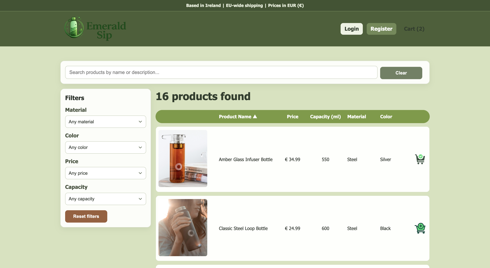

**2. Shopping Cart**
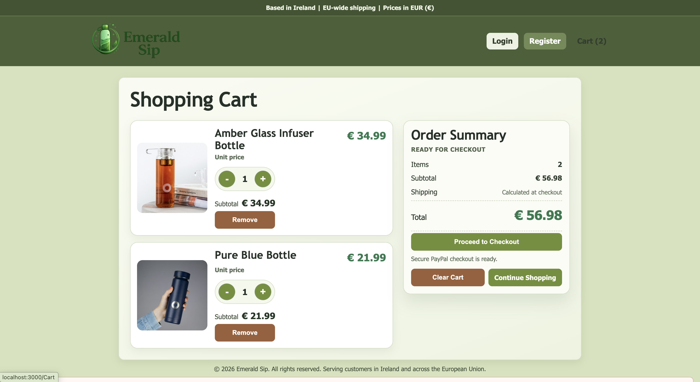

**3. Guest Checkout Validation**
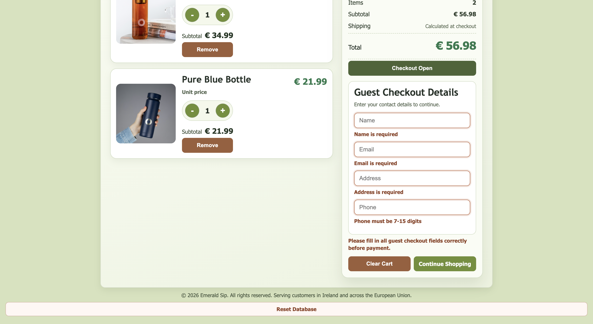

**4. Login Page**
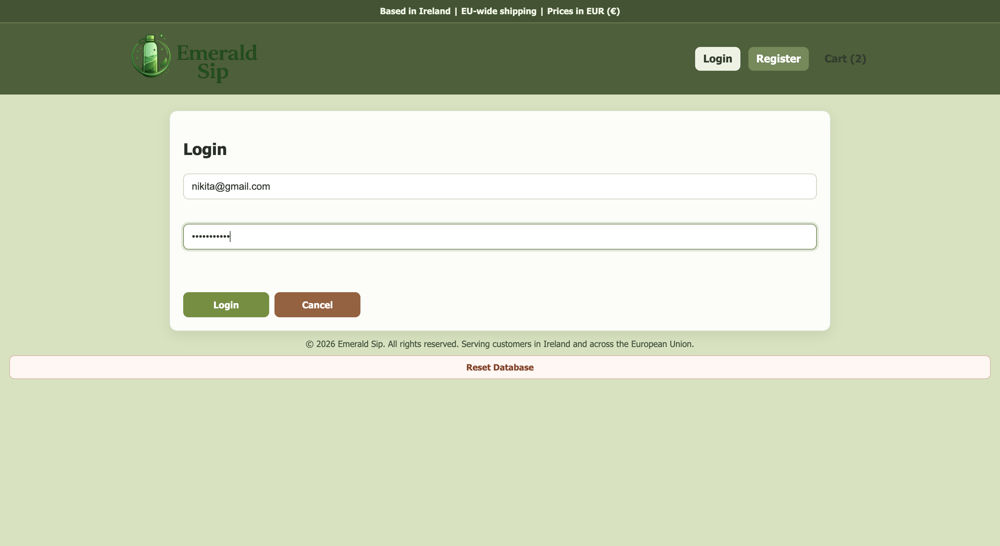

**5. Product Catalog (Admin Management View)**
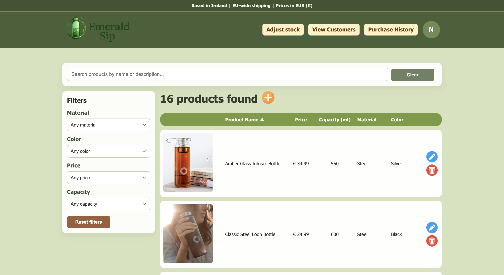

**6. Admin Adjust Stock**
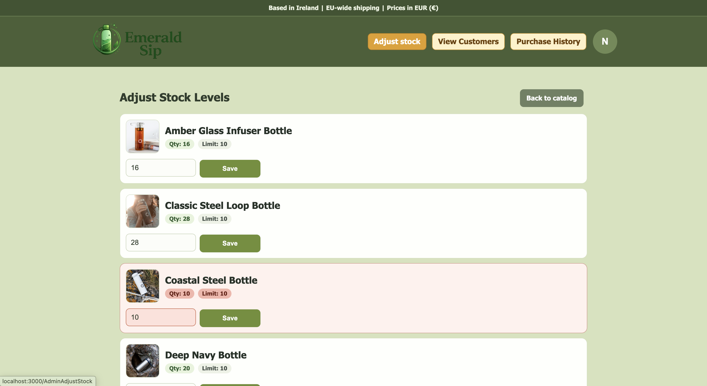

**7. Admin View Customers**
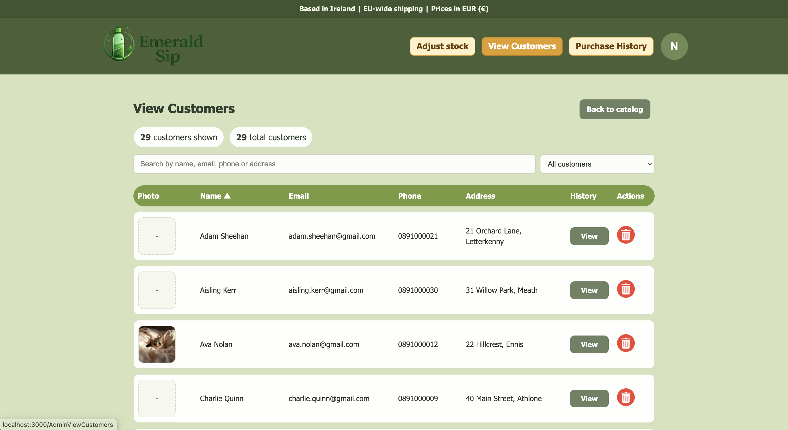

**8. Admin Customer Purchase History**
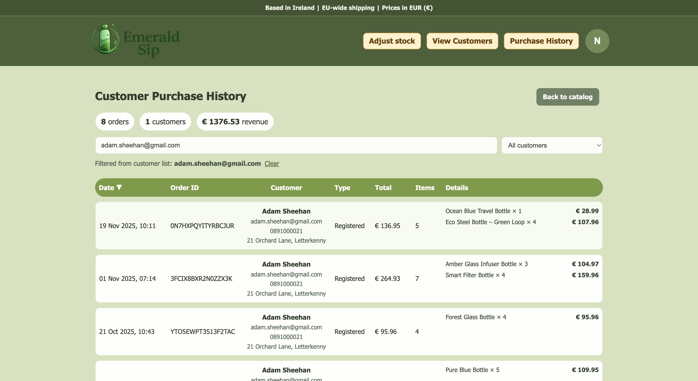

**9. Admin Profile Modal**
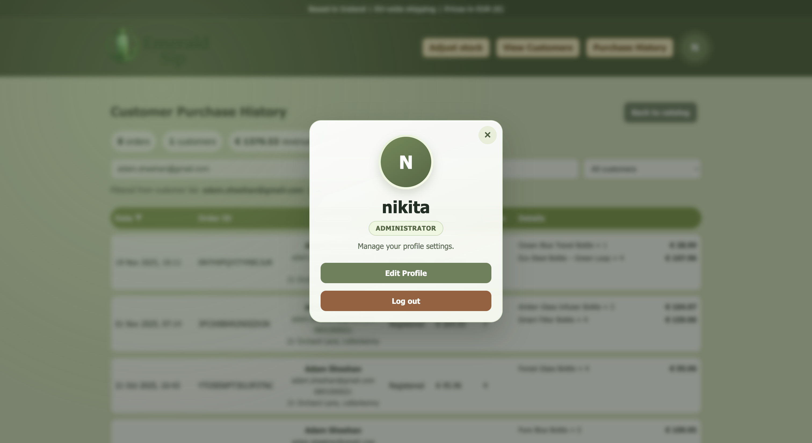

**10. Edit Profile Page**
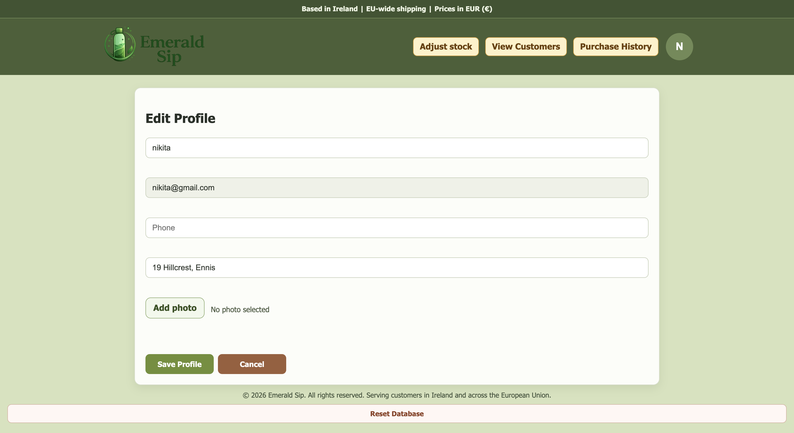

**11. Registration Page**
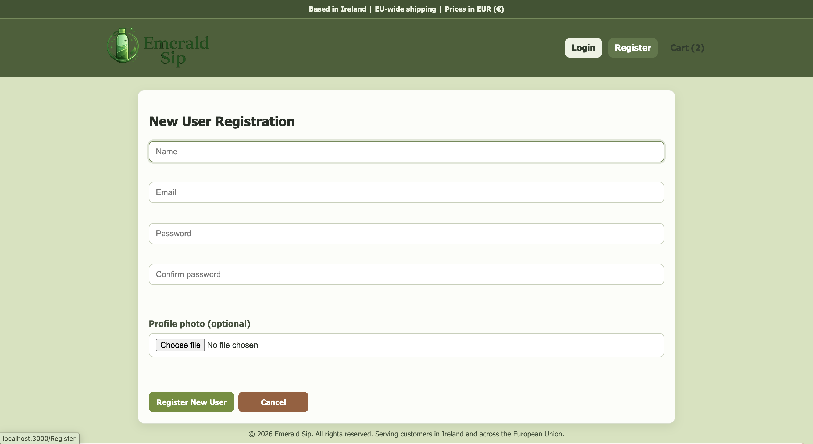

**12. Product Catalog (Logged-In Customer View)**
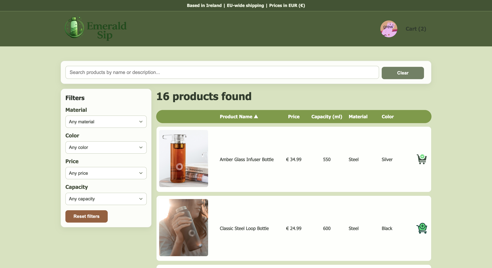

**13. Product Catalog with Active Filters**
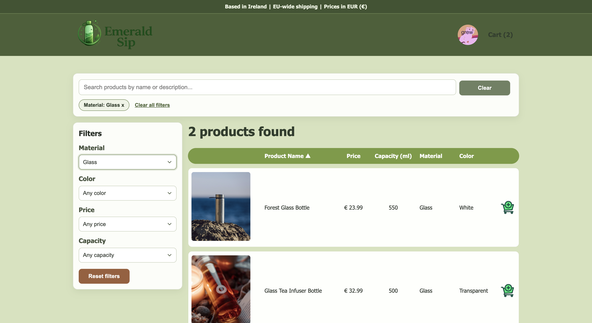

**14. Customer Purchase History**
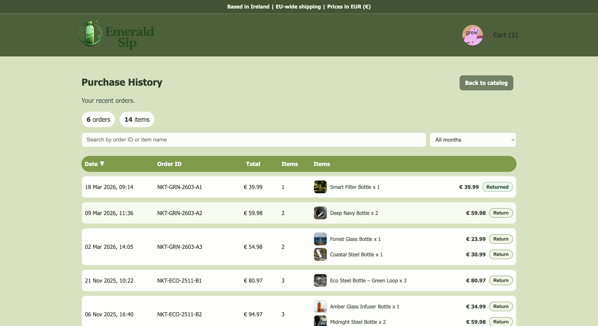

</details>

## Prerequisites

- Node.js 18+ (recommended)
- npm
- MongoDB running locally on default host/port (`mongodb://localhost`)

## Environment Configuration (Server)

The backend loads environment variables from:

- `server/config/.env`

Current required keys:

```env
DB_NAME=SustainableHomeStore
ACCESS_LEVEL_GUEST=0
ACCESS_LEVEL_CUSTOMER=1
ACCESS_LEVEL_ADMIN=2
JWT_PRIVATE_KEY_FILENAME=./config/jwt_private_key.pem
JWT_EXPIRY=7d
PASSWORD_HASH_SALT_ROUNDS=3
UPLOADED_FILES_FOLDER=./uploads
SERVER_PORT=4000
LOCAL_HOST=http://localhost:3000
```

## Local Setup

1. Install dependencies:

```bash
cd server && npm install
cd ../client && npm install
```

2. Start MongoDB locally.

3. Start backend (port `4000`):

```bash
cd server
nodemon
```

4. Start frontend (port `3000`):

```bash
cd client
npm start
```

5. Open:
- `http://localhost:3000`

## Development Notes

- Client API base URL is defined in:
  - `client/src/config/global_constants.js` (`SERVER_HOST`)
- PayPal sandbox client ID is currently stored in:
  - `client/src/config/global_constants.js`
- Profile images uploaded from the app are stored in:
  - `server/uploads`
- A testing-only reset UI exists at:
  - `/ResetDatabase`
  - It resets the user collection and recreates the default admin account:
    - Email: `admin@admin.com`
    - Password: `123-qwe_QWE`

## Seed Data

Default JSON datasets are available in:

- `server/seeds/default/products.json`
- `server/seeds/default/users.json`
- `server/seeds/default/sales.json`

These files can be used for local database initialization/import workflows.

## API Overview

Main route groups:

- `/products`
  - Public catalog read
  - Admin create/update/delete
- `/users`
  - Register/login
  - Profile read/update
  - Admin customer management
- `/sales`
  - Guest and authenticated checkout
  - Customer purchase history
  - Item return route
  - Admin purchase history
